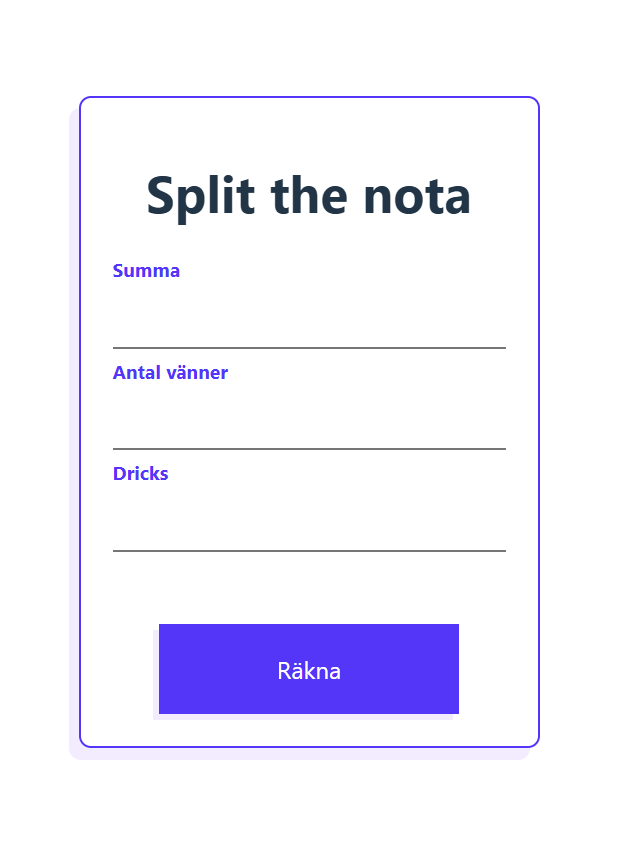
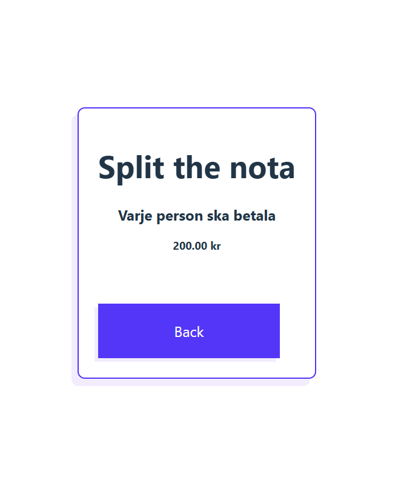

# 🍽️ Split the Nota
A simple React app to split the bill among friends, including tip.
Perfect for dinners where you want to quickly calculate how much each person owes.

## 🚀 Features

- Enter total amount of the bill
- Enter the number of people sharing the bill
- Enter tip in decimal form (e.g., 0.15 for 15%)
- Calculates how much each person pays
- Rounds up to the nearest whole number (no one pays less)
- Navigation between form and results using React Router

## 🛠️ Built With

- [React :arrow_upper_right:](https://reactjs.org/) (Functional Components & Hooks)
- [React Router v6 :arrow_upper_right:](https://reactrouter.com/)
- [Vite :arrow_upper_right:](https://vitejs.dev/)
- JavaScript (ES6)
- CSS

## 📸 Screenshots

**Form Page**


**Results Page**
 

 ## 📦 Installation

1. Clone the repository:

```
git clone https://github.com/AVega89-0407/split-the-nota.git
```

2. Install dependencies:
```
npm install
```

3. Start development server:
```
npm run dev
```

4. Open in browser:
```
http://localhost:5173
```
## 🗂️ Project Structure
```
src/
├── components/
│   ├── Header.jsx
│   └── Form.jsx
├── pages/
│   └── Results.jsx
├── App.jsx
├── main.jsx
└── index.css
```
## 👤 Author

Andrea Vega Piñones

📍 React project for learning and practical use